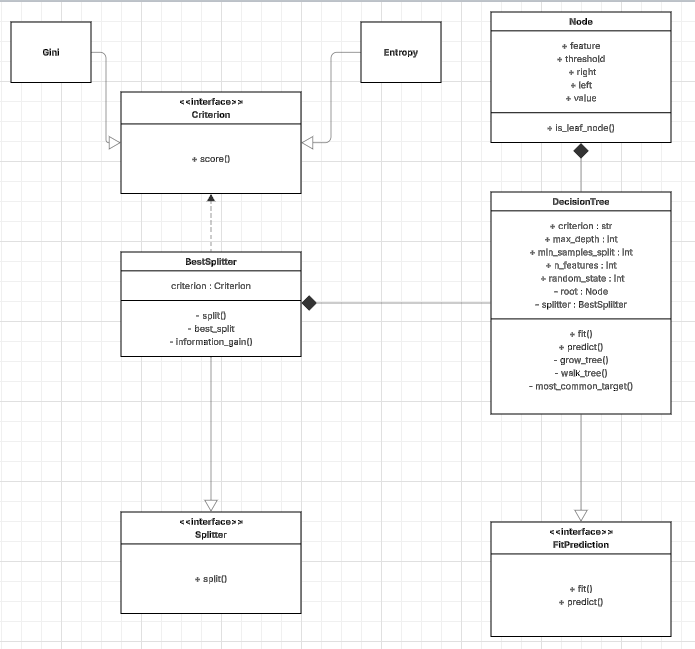

# Relatório Técnico

## Objetivo 

_Desenvolver um algoritmo de árvore de decisão do zero, aplicando o design pattern SOLID_

## Estrutura do projeto

```bash
├── core/  
    ├── criterion.py 
    ├── exceptions.py
    ├── model.py 
    ├── node.py 
    ├── splitter.py 
    ├── tree.py 
```

## Descrição dos arquivos

- **criterion.py** → _Arquivo que implementa os critérios utilizados na construção da árvore, como entropia e índice de Gini._

- **exceptions.py** → _Arquivo responsável pela definição de exceções personalizadas utilizadas no projeto._

- **model.py** → _Arquivo que contém os contratos (interfaces) dos modelos desenvolvidos, garantindo padronização e desacoplamento entre os componentes._

- **node.py** → _Arquivo que define a classe Node, responsável por representar cada nó da árvore de decisão._

- **splitter.py** → _Arquivo que implementa as classes responsáveis pelos métodos de divisão (splits) utilizados na criação dos nós._

- **tree.py** → _Arquivo que contém as implementações das árvores de decisão desenvolvidas._


## Diagrama UML 




### Implementação dos princípios SOLID aplicados

#### SRP (Single Responsability)

> _Cada classe deve apresentar uma única responsabilidade, assim não temos uma classe com inúmeros métodos (Classe "Deus")_

_Este conceito pode ser observado na classe DecisionTree_

```python
from splitter import BestSplitter


def __init__(...):
        ...
        self._splitter = BestSplitter(criterion=TREE_CLF_CRITERION[criterion])
    
   def _grow_tree(self, X,y, depth=0):
        ...
        best_feature, best_threshold = self._splitter._best_split(X,y, selected_features)
        
        left_idxs, right_idxs = self._splitter._split(X[:, best_feature], best_threshold)
        
        left = self._grow_tree(X[left_idxs, : ], y[left_idxs], depth + 1)
        right = self._grow_tree(X[right_idxs, : ], y[right_idxs], depth + 1)
```

_Com o auxílio da classe BestSplitter, toda a lógica da divisão de dados para a construção dos nós, cabe apenas a BestSplitter_


#### OCP (Open/Closed Principle)

> _Não editar códigos já existentes, ao invés disso adicione um novo comportamento_

_Este conceito pode ser observado novamente na classe DecisionTree_


```python
from criterion import Entropy, Gini

TREE_CLF_CRITERION = {
        'entropy': Entropy,
        'gini': Gini
}

def __init__(...):
        ...
        self._splitter = BestSplitter(criterion=TREE_CLF_CRITERION[criterion])
```

_Caso seja necessário a implementação de um novo critério, basta ir no arquivo criterion.py, desenvolve-lo e adicionar no dicionário de critérios_


#### LSP (Liskov Substitution Principle)

> _Subtipos devem ser substituíveis por seus tipos base sem alterar o comportamento esperado_

_Qualquer __criterion__ pode substituir outro sem quebrar a árvore_

```python
TREE_CLF_CRITERION = {
        'entropy': Entropy,
        'gini': Gini
}
class DecisionTree(FitPrediction,  BaseEstimator, ClassifierMixin):
        def __init__(self, 
                        criterion: Literal['entropy', 'gini'] = 'entropy',
                        ...
        )
```

#### ISP (Interface Segregation Principle)

> _Interfaces criadas devem ser simples e especificas, uma classe não deve depender de um método que não utiliza_

_Foram criadas interfaces vizando atender a apenas um objetivo e garantir a utilização de todos os métodos presentes nela_


__criterion.py__
```python
class Criterion(ABC):
    
    @abstractmethod
    def score(self, y): ...
    
class Entropy(Criterion): ... 

class Gini(Criterion):....
```

__model.py__
```python

class FitPrediction(ABC): 
    @abstractmethod
    def fit(self, X,y):...
    
    @abstractmethod
    def predict(self, X):...


class DecisionTree(FitPrediction): ...
```

#### DIP (Dependency Inversion Principle)

_Módulos de alto nível devem depender de abstrações_

_A classe BestSplitter depende diretamente de um Criterion_

```python
class BestSplitter(Splitter):
    def __init__(self, criterion:Criterion):
        self.criterion = criterion()
```


## Conclusão

_O modelo desenvolvido apresentou desempenho consistente em problemas de classificação binária, mostrando-se capaz de construir árvores adequadas e generalizar bem nesse cenário. Entretanto, observou-se uma queda de performance em datasets multiclasses, indicando oportunidades de melhoria na estratégia de divisão ou no critério de avaliação._
_Em termos computacionais, o tempo de treinamento foi superior ao da implementação presente no scikit-learn, o que era esperado devido ao alto nível de otimização da biblioteca. Como trabalho futuro, planeja-se a migração de partes críticas do algoritmo para código em C, utilizando Cython, com o objetivo de reduzir o tempo de execução e tornar o modelo mais escalável para datasets maiores._
